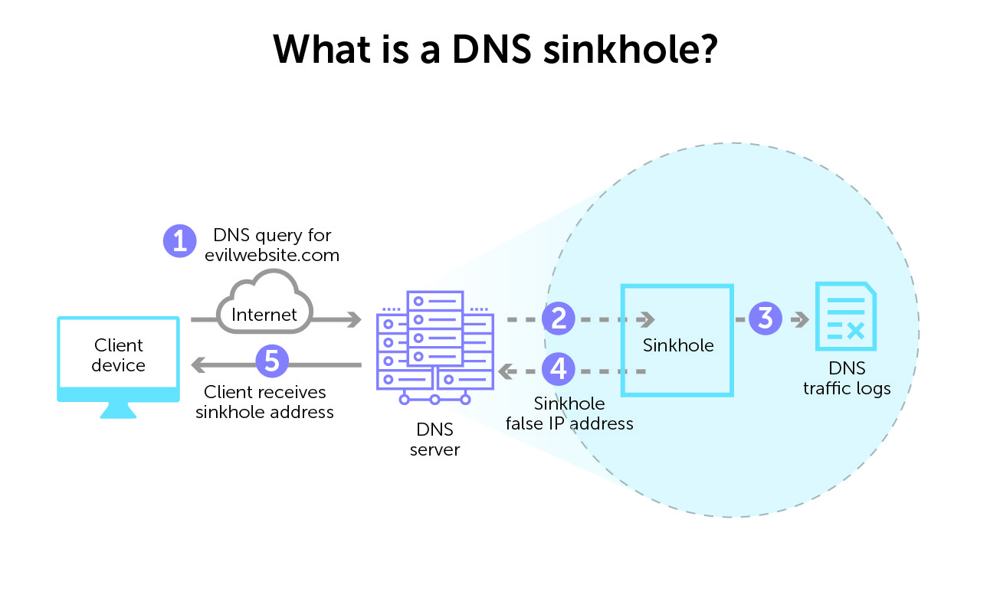

# Projektidee (aus dem Einreicheformular)

Ich möchte die Zertifizierung von AWS abschliessen und möchte meinen Werdegang dokumentieren. Um mein Können daraufhin zu beweisen, möchte ich zusätzlich einen Service auf AWS einrichten. Als primäre Idee möchte ich einen DNS Sinkhole Service (Ad Blocker) aufbauen, sollte mir dies nicht gelingen, so möchte ich einen Wireguard Web Gateway (pers. VPN mit statischer öffentlicher IP). Dadurch kann ich garantieren, dass ich im Falle eines totalen Ausfalls meiner Fähigkeiten bei der Zertifizierung und beim Aufsetzen des Sinkhole Servers immer noch eine Alternative habe.

Die Zertifizierung stellt dabei das Hauptziel dieser Arbeit dar und wird die meiste meiner Zeit beanspruchen. Ich habe daher einen eher kleinen Service gewählt, welchen ich als Nebenprojekt aufsetzen möchte.

## Das Nebenprojekt

Wie bereits erwähnt möchte ich einen DNS Sinkhole Server aufsetzen.

Ein DNS Sinkhole Server leitet DNS Anfragen für unerwünschten Domains (z.b. ads.google.com / *frei erfunden*) nicht weiter, sondern gibt einen "Error" zurück.

Der Client, welcher also diesen DNS-Server konfiguriert hat, kann bestimmte Domains, welche Werbung liefern nicht mehr abfragen. Das resultiert schlussendlich in weniger Werbung, da die eigentliche Werbung auf der Webseite nicht angezeigt werden kann, da die Ressourcen fehlen.

Ursprüngliche wurde diese Technik als Malwareschutz verwendet, da unbekannte, nicht erlaubte Domains einfach nicht aufgelöst wurden.

-----

[Zurück zum Unterverzeichnis](./README.md)
