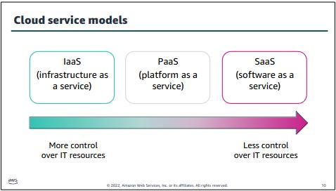
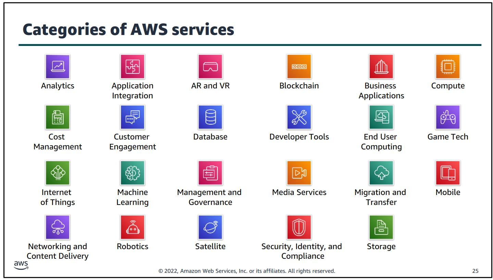

# Modul 1

## Introduction to cloud computing

Grundsätzlich kannte ich das Thema Cloud-Computing schon ein bisschen, die Verlagerung von Compute Power auf eine "Drittperson", kommt immer wieder auf.
Den Vorteil weniger Hardware zu unterhalten ist dabei immer das erstgenannte Argument. Neu war für mich die klare Aufzeigung, dass nicht nur zu wenig Computing Power schädlich ist, sondern auch zu viel, da dann Ressourcen bezahlt wurden, welche nicht gebraucht werden.
Amazon mit ihrem dynamischen Preismodell ist da viel flexibler. Dies spiegelt sich unter anderem auch in Personalkosten wider, da weniger Hardware / Netzwerk Spezialisten benötigt werden, um die physische Infrastruktur zu unterhalten.

Ganz wichtig für die Unterscheidung zwischen den verschiedenen Cloud-Computing Modellen sind die Bezeichnungen **IaaS, PaaS and SaaS.**

[Bild Quelle - IaaS to SaaS](../../Anhang/quellen.md#iaas-to-saas)

Diese drei Begriffe grenzen sich durch die unterschiedlichen Zugriffsberechtigungen auf die effective Hardware ab.
IaaS biete dabei den grössten Zugriff auf die eigentliche Hardware (z.b. mit der Möglichkeit CPU Cores pro VM erhöhen oder senken zu können), während SaaS die abstrakteste Form von Cloud-Computing darstellt. (z.b. Microsoft Office im Browser, jegliche Software, welche früher auf einem lokalen PC installiert gewesen wäre, lauft nun auf der Cloud von Microsoft).

Nebst dieser Differenzierung um die Abstraktion zu definieren, gibt es noch die Begriffe **Cloud, Hybrid und On-Premise** um das Deployment Modell darzustellen.
Die beiden Gegenpole sind Cloud und On-Premise. Cloud bedeutet eigentlich das jegliches Computing auf der Public Cloud passiert. Kundendaten und Traffic fliesst ausschliesslich über die Cloud von z.b. Amazon. On-Premise ist das Gegenteil, insofern das alle Daten auf lokalen Servern verarbeitet werden.
Hybrid ist wie der Name schon sagt eine Vermischung dieser zwei Faktoren.

[Bild Quelle - Cloud to On-Premise](../../Anhang/quellen.md#cloud-to-on-premise)

## Advantages of Cloud Computing

Es gibt 6 hervorgehobene Vorteile von Cloud-Computing.

Diese Beispiele möchte ich hiermit aufzeigen.

### "Trade CapEx for OpEx"

Die hohen anfänglichen Kosten für die Beschaffung der Hardware (CapEx) fallen weg, und werden durch laufende Kosten im Abonnentenmodell (OpEx) ersetzt.

Dadurch zahlt man effektiv nur für die genutzte Leistung. Die Personalkosten für das Unterhalten der Hardware fallt weg, und kann dazu eingesetzt werden, das Unternehmen in anderen Bereichen vorwärtszubringen.

[Bild Quelle - CapEx for OpEx](../../Anhang/quellen.md#capex-to-opex)

### "Economies of Scale"

Amazon verspricht, bei höherer und effektiverer Auslastung ihrer Infrastruktur die dadurch entstehenden Kostenvorteile an die Kunden weiterzugeben.

[Bild Quelle - Economies of Scale](../../Anhang/quellen.md#economies-of-scale)

### "Stop guessing Capacity"

Wie anfänglich erwähnt, ist die Unter- und Überbelastung von physischen Servern das grösste Problem.

Bei Unterbelastung haben wir zu hohe CapEx Kosten, welche durch die NICHT effektive Auslastung langsamer amortisiert werden können.

Bei einer Überbelastung, riskieren wir, das einige (oder alle, im Falle einer Störung) Kunden unseren Service nicht mehr erreichen.

Das führt zu einem negativen Bild des Unternehmens und kann uns zukünftige Einnahmen verweigern.

Bei AWS kann man je nach Bedarf zusätzliche Computing Power innert kürzester Zeit nutzen.

[Bild Quelle - Guessing Capacity](../../Anhang/quellen.md#guessing-capacity)

### "Increase Speed and Agility"

Bei Bedarf nach mehr Computing Power, kann das ganze innerhalb weniger Minuten gemacht werden. Beim traditionellen Ansatz von physischen Servern, muss man unter Umständen mehrere Wochen warten, bis man die benötigte Hardware einsetzen kann.

[Bild Quelle - Speed and Agility](../../Anhang/quellen.md#speed-and-agility)

### "Stop spending Money on running and maintaining data centers"

Jedes Unternehmen sollte sich auf Ihren eigentlichen Geschäftszweig fokussieren können.

Es ist kontraproduktiv für eine Bank mehr Zeit (dadurch Personalkosten) in den Unterhalt eines Rechenzentrums zu stecken, als diese Zeit im Banking zu nutzen.

[Bild Quelle - Main Business focused](../../Anhang/quellen.md#main-business-focused)

### "Go global in minutes"

Man kann durch einige wenige Klicks innerhalb weniger Minuten seine Server in der ganzen Welt bereitstellen.

Die ermöglicht eine effiziente Verteilung seiner Dienste, sodass alle Kunden möglichst wenig Latenz haben.

[Bild Quelle - Global in minutes](../../Anhang/quellen.md#global-in-minutes)

## Introduction to AWS

AWS ist aufgebaut aus verschiedenen kleinen Diensten, welche zusammen eine möglichst identische Umgebung Online aufbauen, wie On-Premise.

Diese Services werden in verschiedene Kategorien eingeteilt.

[Bild Quelle - Service Kategorien](../../Anhang/quellen.md#service-kategorien)

### Ways to interact with AWS

Amazon bietet 3 Möglichkeiten, um mit AWS zu interagieren.

* AWS Management Console, ganz einfach über den Webbrowser.
* Command Line Interface (AWS CLI), muss vorgängig installiert und authentifiziert werden.
* Software Development Kits (SDKs), kann direkt in Code eingebunden werden (importiert).

## Moving to AWS

AWS bietet das "Cloud Adoption Framework" (CAF) um den Wechsel von On-Premise Diensten auf Cloud Dienste zu vereinfachen.

Das CAF besteht aus sogenannten Perspektiven, welche in zwei Fähigkeiten eingeteilt werden können. Perspektiven mit technischen Fähigkeiten und Perspektiven mit Business Fähigkeiten.

[Bild Quelle - Cloud Adoption Framework](../../Anhang/quellen.md#cloud-adoption-framework)

Wenn sich jede Perspektive auf ihre Aufgaben fokussiert und die Perspektiven im regen Austausch sind, hat das Projekt gute Chancen.

### Business Perspektive

Strategische und finanzielle Entscheide werden auf dieser Stufe entschieden. Diese Stufe muss sichergehen, dass die IT geschäftsorientiert ist und alle Kosten nachvollziehbar sind.

### People Perspective

Das HR Management wird auf dieser Stufe erledigt. Diese Stufe muss sich darauf fokussieren, Leute mit dynamischem Wissen anzueignen, oder die internen Leute weiter auszubilden.

### Governance Perspective

Politische Entscheide, die das ganze Unternehmen betreffen werden auf diese Stufe erledigt. Diese Stufe muss sichergehen, dass die IT Strategie und Ziele mit den Unternehmenszielen und Strategie übereinstimmt.

### Platform Perspective

Diese Stufe ist für die ganze IT Plattform verantwortlich, also wie die ganze Plattform aufgebaut ist. Diese Stufe muss sich im Klaren sein, wie die jetzige Plattform aufgebaut ist, und wie man zum gewünschten Zustand kommt.

### Security Perspective

Diese Stufe ist für die Sicherheit im Unternehmen verantwortlich. Diese Stufe muss sichergehen, dass bei einem Platform Change die Sicherheitsrichtlinien weiterhin erhalten werden können.

### Operations Perspective

Diese Perspektive sorgt für die erfolgreiche Integration der IT in die Strukturen des Alltagsbusiness. Sie muss sichergehen, dass dies in Zukunft weiterhin funktioniert.

-----

[Zurück zum Unterverzeichnis](../README.md)
