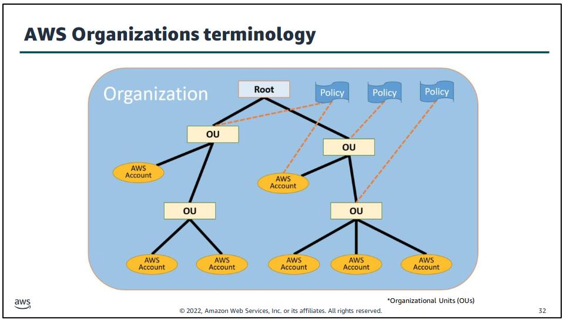

# Modul 2

Es werden zwar keine direkten Zahlen genannt, da dies wie erwähnt sehr dynamisch ist, jedoch finde ich dieses Modul sehr wichtig.

Die Abrechnung der Kosten im Vergleich zu den Einnahmen eines Unternehmes ist sehr wichtig.

Daher ist es auch wichtig, dass man weiss wie diese Abrechnung aufgebaut ist.

## Fundamentals of Pricing

Die Kosten für die AWS Nutzung werden aus 3 Komponenten errechnet.

* Compute Power, basierend auf Nutzung in Stunden/Sekunden. Die Kosten variieren immer aufgrund der unterschiedlichen Instanz Typen. (Sprich unterschiedliche CPUs)
* Storage, Preise per GB.
* Data Transfer, Outbound traffic kostet, Inbound traffic ist grundsätzlich "Free of Charge". Wird abgerechnet pro GB.

### "Pay for what you use"

Nutzungsbasierte Abrechnung, man bekommt verrechnet, was man auch effektiv genutzt hat.

### "Pay less when you reserve"

Wenn man Ressourcen vor Gebrauch reserviert kann Amazon besser planen.

Durch diesen Vorteil können Sie uns einen kleinen Rabatt garantieren.

### "Pay less when you use more and as AWS grows"

Wie bei allen Dienstleistern, hat AWS einen Overhead, welcher bezahlt werden muss.

Sobald dieser Overhead abbezahlt ist, beginnt AWS damit die Vorteile diese abbezahlten Overheads an den Kunden weiterzugeben.

Wenn man also einen S3 Bucket hat, diesen aber nur mit 2 GB Daten abfüllt, zahlt man per GB mehr, als wenn man z.B. 10 GB in diesem Bucket hat.

AWS verspricht auch, dass zusätzliche Gewinne Ihrerseits an den Kunden weitergegeben werden.

Dies war bereits 75 Mal der Fall, mit Preissenkungen.

### Custom Pricing

Sollten die vorbestimmten Preismodelle auf unser Unternehmen nicht passen, ist AWS offen für ein Custom Pricing Agreement.

## Total Cost of Ownership (TCO)

Die Abrechnung der genutzten Ressourcen zeigt noch nicht das ganze Bild. Da wir für den Vergleich mit On-Premise auch nebensächliche Kosten miteinbeziehen müssen.

Wie z.B. die ersparte Stromrechnung, weniger Personalkosten uns so weiter.

Im Grunde genommen kann gesagt werden, dass die beiden Ansätze Cloud und On-Premise nicht einfach so verglichen werden können.

[Bild Quelle - Not Comparable](../../Anhang/quellen.md#not-comparable)

Damit dieser Vergleich aber trotzdem gemacht werden kann, empfiehlt sich der TCO. Mit dem TCO werden alle diese zusätzlichen Faktoren mit einberechnet.

Wie im nachfolgenden Bild zu sehen ist, betrachtet der TCO 4 Hauptkostenpunkte, mit einzelnen Unterkategorien.

Nebenkosten wir das Personal, der Lifecycle und Strom werden dabei auch in Betracht gezogen.

[Bild Quelle - TCO Considerations](../../Anhang/quellen.md#tco-considerations)

### AWS Pricing Calculator

Mit dem AWS Pricing Calculator können die Kosten für den Betrieb unseres Unternehmens in der AWS Cloud berechnet werden.

Er kann dazu genutzt werden, ein Design mit einem Preis zu beziffern und gibt nützliche Ratschläge um die Kosten zu minimieren.

### Hard und Soft Benefits

AWS unterscheidet zwischen Hard Benefits, welche mit einem effektiven Geldbetrag beziffert werden können, und Soft Benefits, welche dem Unternehmen in die Zukunft helfen, jedoch nicht mit einem Preisschild versehen werden können.

Zum Beispiel:

* Ein Hard Benefit ist, das die CapEx Kosten mit dem Einsatz von AWS Cloud gesenkt werden können.
* Ein Soft Benefit ist, die Befreiung der Mitarbeiter vom Hardware Management, was Ressourcen öffnet, um das Geschäft zu expandieren.

## AWS Organizations

Organizations erlaubt uns, mehrere AWS Accounts Billings zu kombinieren. Bei einem grossen Unternehmen, bei welchem man einzelne Teams mit unterschiedlichen Accounts hat, macht dies die Abrechnung einfacher, da dies zentral gemacht werden kann.

[Bild Quelle - Tree Structure of AWS Organizations](../../Anhang/quellen.md#tree-structure-of-aws-organizations)

Wie hier zu sehen ist, sind Organizations in einem "Baum" strukturiert. Auf mehreren Ebenen dieses Baums können Policy eingesetzt werden.

Was Policy genau sind, werden wir später anschauen. Mit dieser Struktur kann man auch "Gruppen" erstellen um das Team Management einfacher zu machen.

Das IAM (Identity and Access Management) muss weiterhin für jeden Account separat gemacht werden. Da ein einzelner Account mehrere User beinhalten kann, eine Organization aber nur Policy auf Account Ebene machen kann, muss dies mit IAM besser aufgeteilt werden.

## AWS Billing & Cost Management

Was ist Billing eigentlich genau und wie funktioniert es?

Billing ist die eigentliche Abrechnung der genutzten AWS Dienste. Dazu gibt es verschiedene Tools und Dashboards, welche das ganze aufzeigen.

Man kann die vergangenen Abrechnungen anschauen, oder Forecasts für die erwarteten Kosten, sollte man AWS Services weiterhin so nutzen wie in diesem Moment.

[Bild Quelle - Billing Stats](../../Anhang/quellen.md#billing-stats)

Hier zum Beispiel, ein Dashboard für die momentanen Kosten, verglichen mit den Vormonaten und eine Aufteilung auf die einzelnen AWS Dienste.

Für diese einzelnen Werte gibt es noch fortführende Dashboards, welche das ganze noch granularer aufteilen und darstellen können. Das Grundprinzip habe ich verstanden, und gehe nicht weiter auf diese Dashboards ein.

## Technical Support Models

AWS bietet verschiedene Tools und Dienste, für einen optimalen Support.

* AWS Support Concierge, für generelle Account Hilfe.
* AWS Trusted Advisor, für Best Practices.
* Technical Account Manager, für proaktive Hilfe beim Setup.

Wichtiger sind dabei die "Support Plans" welche einen geschichteten Support darstellen und mehr kosten, umso höher die Support Stufe ist.

[Bild Quelle - Support Plans](../../Anhang/quellen.md#support-plans)

[Bild Quelle - Reaction Times](../../Anhang/quellen.md#reaction-times)

Diese Listen sind ziemlich selbsterklärend und benötigen keine weiteren Ausführungen.

-----

[Zurück zum Unterverzeichnis](../README.md)

[Zum nächsten Modul](./modul3.md)
