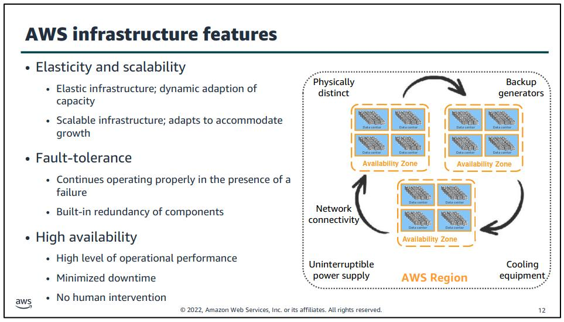
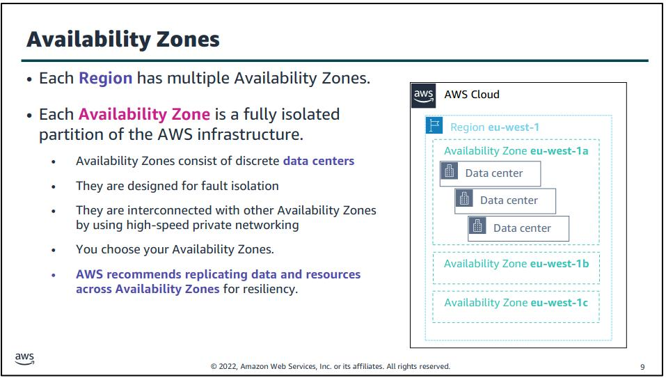
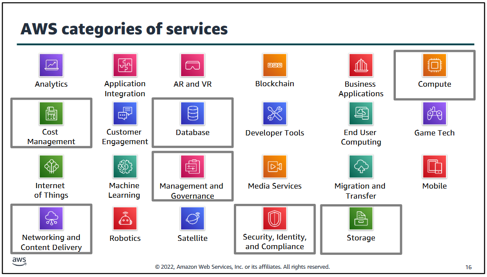

# Modul 3

## AWS Global Infrastructure

[Bild Quelle - Infrastructure Overview](../../Anhang/quellen.md#infrastructure-overview)

Was sind Regions und Availability Zones?

Grundsätzlich kann man sagen, dass eine Region dazu genutzt wird, in dieser effektiven Region einen Service bereitzustellen.

Während Availability Zones innerhalb dieser Zonen eine Redundanz bilden. Availability Zones werden für Hochverfügbarkeit verwendet.

### AWS Regions

Eine AWS Region ist eine geografische Umgebung, z.B. Nordeuropa oder Westamerika.

Innerhalb dieser Region, welche AWS anbietet, gibt es jeweils zwei oder mehrere Availability Zones.

Innerhalb einer Region garantiert AWS eine bestimmte Bandbreite und Latenz zwischen Services.

Interregional kommunizieren AWS Regionen auf separaten Links, welche von Amazon bereitgestellt werden, die aber nicht die gleichen Konditionen haben, wie die Links innerhalb einer Region.

[Hier, kann man die einzelnen AWS Regionen besser anschauen.](https://aws.amazon.com/de/about-aws/global-infrastructure/#AWS_Global_Infrastructure_Map)

### AWS Availability Zones

[Bild Quelle - Availability Zones](../../Anhang/quellen.md#availability-zones)

Eine Region besteht, wie erwähnt aus zwei oder mehreren Availability Zones. Eine Availability Zone besteht aus mehreren Datacenters (mindestens ein Datacenter).

Availability Zones sind untereinander (in der gleichen Region) verbunden mit "high bandwidth, low latency networking over fully redundant, dedicated fiber".

AWS geht nicht weiter darauf ein, was dies genau bedeutet.

### AWS Data Centers

Innerhalb der Availability Zone, sind eine oder mehrere Datacenters. Diese Standorte sind offiziell nicht öffentlich und Kunden wissen nicht in welchem Datacenter ihre Daten sich befinden.

Datacenter sind redundant aufgebaut, mit z.B. redundanter Stromzulieferung.

### AWS Cloudfront

Cloudfront ist ein CDN (Content Delivery Network). Dienste wie z.B. YouTube welche nicht selbst Infrastruktur bauen möchten, um ihren Content weltweit verbreiten zu können, können auf Cloudfront zurückgreifen.

Dieses Netzwerk besteht aus Points of Presence, welche häufiger sind als normale AWS Regions. Amazon nennt diese PoP "Edge Locations".

Diese Edge Locations dienen als Cache Service, welcher Daten näher beim User speichert. Dies verhindert längere Requests über die halbe Welt und erhöht die Kundenzufriedenheit.

## AWS Services & Service Categories

Wie bereits mehrfach erwähnt, bietet AWS mehrere Services an. Der Cloud Foundational Kurs wird sich auf die folgenden Kategorien fokussieren. Die einzelnen Kategorien haben alle eine spezielle Farbe, z.B. sind alle Storage Services Grün.

[Bild Quelle - Service Overview](../../Anhang/quellen.md#services-overview)

* Storage Services - Grün
* Compute Services - Orange
* Database Services - Blau
* Networking & Content Delivery Services - Violett
* Security, Identity and Compliance Services - Rot
* Cost Management Services - Hellgrün
* Management and Governance Services - Pink

Mehr zu den einzelnen Kategorien kann man [hier](https://awsacademy.instructure.com/courses/40895/modules/items/3510678) ab Seite 21 nachlesen.

-----

[Zurück zum Unterverzeichnis](../README.md)

[Zum nächsten Modul](./modul4.md)
