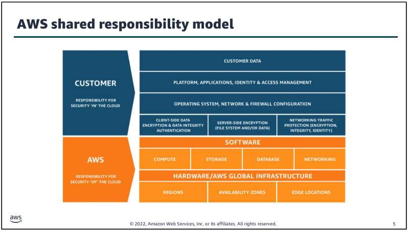
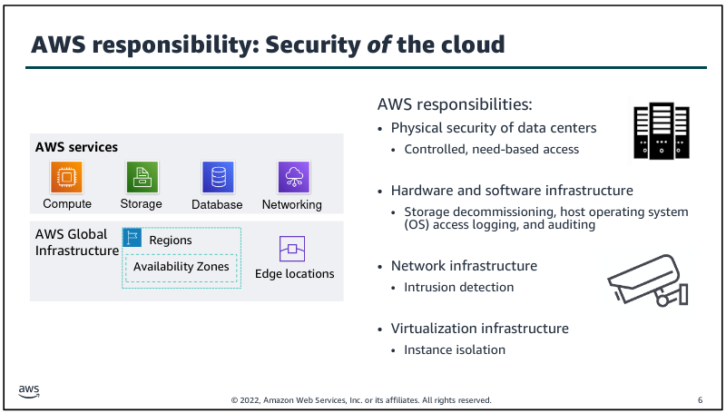
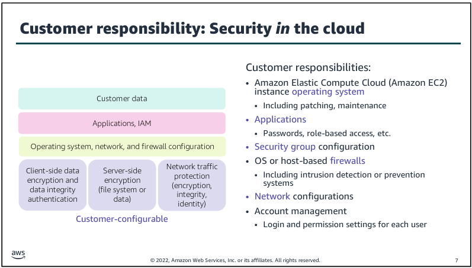
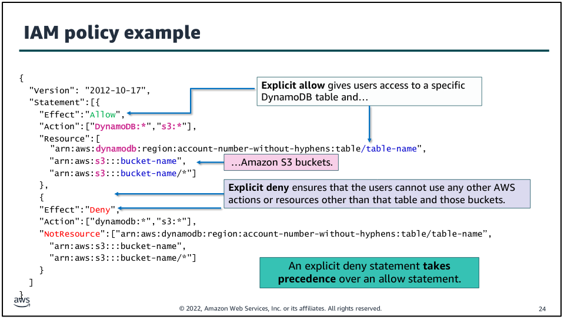

# Modul 4

## Shared Responsibility Model

AWS unterteilt die Verantwortlichkeiten für die Security auf den Kunden und sich selbst.

Grundsätzlich gibt es dazu zwei Leitfäden:

* Die Kunden sind verantwortlich für die Sicherheit IN der Cloud.
* AWS ist verantwortlich für die Sicherheit der Cloud an sich.

[Bild Quelle - Shared Responsibility Modell](../../Anhang/quellen.md#shared-responsibility-model)

### Security OF the Cloud

AWS ist verantwortlich für den "as a Service" Teil von Iaas, SaaS und PaaS.

Je nachdem welcher Cloud Hosting Type momentan geltend ist, ist AWS verantwortlich, dass die darunter laufende Hardware / Software sicher ist.

Sie erreichen dies unter anderem durch sichere Rechenzentrum Zugänge. Keine Person, welche nicht von AWS dazu authorisiert wurde, kommt in die Rechenzentren.

[Bild Quelle - Security OF the Cloud](../../Anhang/quellen.md#security-of-the-cloud)

### Security IN the Cloud

Der Kunde ist verantwortlich für die Daten innerhalb der Cloud. Wenn ein Kunde einen Webserver auf einer EC2 Instanz aufbaut, welcher vom Aufbau her schon unsicher ist, kann AWS nicht dafür verantwortlich gemacht werden.

Der Kunde hat selbst sicherzugehen, dass die Daten nicht vom Webserver erreicht werden können, oder verschlüsselt sind.

[Bild Quelle - Security IN the Cloud](../../Anhang/quellen.md#security-in-the-cloud)

## AWS Identity and Access Management (IAM)

IAM ist ein kostenloser Service von Amazon, welcher in jedem Account genutzt werden kann.
Der IAM Service kann genutzt werden, um innerhalb eines AWS Accounts mehrere Benutzer zu erstellen. Anschliessend kann man diesen Accounts bestimmte Rechte zuordnen:

* Wer darf auf welche Ressourcen zugreifen?
* Was kann der Nutzer mit diesen Ressourcen genau machen? (Read / Write / Delete)
* Wie kann diese Ressource genau erreicht werden? (Web Access, API, etc.)

IAM arbeitet mit 4 Komponenten:

* Users (kann auch eine Applikation sein), der sich bei AWS authentifizieren kann.
* Gruppen, welche mehreren Usern die gleichen Rechte geben.
* Policies, die definieren welcher User was kann.
* Roles, die man einem User für eine definierte Zeit / Aktion assignen kann. Meistens verbunden mit einer Policy.

### Authentifikation

Wenn man einen User erstellt, kann man anfänglich definieren, wie dieser sich genau bei AWS anmelden kann.

Wie mehrfach erwähnt gibt es die AWS CLI, die AWS SDKs und die AWS Management Console.

[Referenz zu Modul 1](./modul1.md#ways-to-interact-with-aws)

AWS bietet auch die Möglichkeit MFA für jeden User zu verwenden. Dies erhöht die Sicherheit nochmals massiv.

### Authorisation

AWS verfolgt das "principle of least privilege". Das heisst das jede Zugriff auf eine Ressource explizit erlaubt sein muss.

Standardmässig ist jeglicher Zugriff auf jegliche Ressource nicht erlaubt. Dies wird mit Policies gemacht.

Policies sind einfache JSON Dokumente / Texte. Sie spezifizieren was mit dieser Policy genau erlaubt ist.

Eine Policy kann dann einem oder mehreren Objekten (User, Gruppen) angehängt werden, welche dann diese Rechte erhalten.

Ein Objekt kann nur eine Policy gleichzeitig haben.

Zusätzlich gibt es noch Ressource Based Policies, welche in die umgekehrte Richtung funktionieren. Solange eine Gruppe / ein User nicht in dieser Policy erlaubt ist, wird er die Ressource nicht nutzen können.

[Bild Quelle - Policies](../../Anhang/quellen.md#policies)

### Rollen

Rollen sind ähnlich wie User, insofern das sie Policies assigned bekommen.

User können dann einzelne Rollen wie einen Hut aufsetzen und diese Rolle ausüben.

Die erlaubt das temporäre Ausüben von höheren Rechten als gewöhnlich.

## IAM User sicherer machen

### Securing a New AWS Account

AWS empfiehlt, nicht den AWS Account direkt zu nutzen, sondern mit dem AWS Account einen IAM User zu erstellen, welcher anschliessend genutzt wird, um die Ressourcen zu verwalten.

Dies im Falle, sollte der Nutzer komprimiert sein, hätte man mit dem Root User noch ein Backup um das ganze zu sichern.

Auch empfiehlt AWS für alle Benutzer, auch den Root User, MFA zu verwenden. CloudTrail empfehlen sie um nachverfolgen zu können WAS ein Benutzer genau gemacht hat.

Einen Billing Report sollte man erstellen um zu erkennen welche Ressourcen am meisten Kosten aufrechnen.

### Securing Root Accounts

Wenn eine Organisation mehrere Root User hat, sollte man AWS Organisations nutzen.

[Referenz zu Modul 2](./modul2.md#aws-organizations)

### AWS Cognito & Key Management System (KMS)

KMS bietet ein Key Verwaltungstool, für alle AWS Keys und integriert sich nahtlos mit CloudTrail. Also sieht man auch dort wann der Key wofür genutzt wurde.

Cognito bietet ein User Verwaltungstool, welches Unternehmen erlaubt Ihren Kunden direkt Access auf ihre AWS Ressourcen zu geben.

### AWS Shields

Mit AWS Shields kann man AWS Dienste gegen DDoS schützen.

### Daten sichern

AWS empfiehlt Daten aus Security Gründen zu verschlüsseln. Mit AWS KMS kann dies direkt von Amazon erledigt werden, z.B. für S3 Buckets.

Sie empfehlen für jegliche Daten im Netzverkehr immer HTTPS (sprich TLS) zu nutzen. TLS kann auch zwischen AWS Ressourcen genutzt werden, z.B. zwischen einem S3 Bucket und einer EC2 Instanz.

-----

[Zurück zum Unterverzeichnis](../README.md)

[Zum nächsten Modul](./modul5.md)
