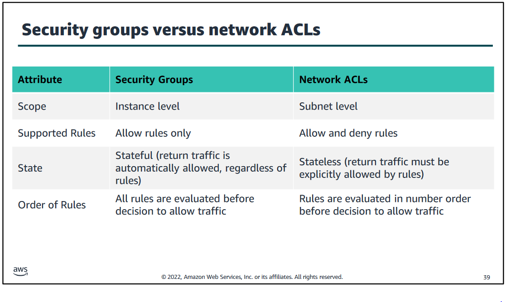

# 2.1.5 Modul 5

Ich persönlich würde mein Wissen bezüglich Networking als fortgeschritten bezeichnen und daher werde ich in diesem Modul nicht allzu viel bezüglich Subnetting oder sonstigen Network Basics schreiben.

## Amazon VPC

VPC bedeutet Virtual Private Cloud. Amazon bietet mit diesem Produkt ein virtualisiertes Netzwerk in der ausgewählten Region an.

Server können innerhalb dieses Netzwerks miteinander kommunizieren und es bietet einige weitere Features eines normalen Netzwerks.

Ein VPC kann sich nur in einer Region befinden. Mehrere Regionen werden nicht unterstützt. Innerhalb eines VPC können mehrere Subnets koexistieren und mehrere Gateways bestimmen das Routing.

Jedes Subnet kann nur auf einer Availability Zone gleichzeitig sein. Diese können als Public oder auch als private Netz konfiguriert werden.

Beim Erstellen eines VPC muss man einen CIDR Range angeben. Dieser CIDR Range kann nach dem Erstellen nicht geändert werden.

Die Grösse des CIDR Range kann zwischen /16 und /28 sein. Also zwischen 65'536 und 16 IP Addressen.

Öffentliche IP-Adressen kann man entweder mit Elastic IPs an den Servern assignen, oder man fügt die Server in ein öffentliches Netz hinzu und sie werden automatisch eine öffentliche zugeteilt bekommen.

Elastic IPs kommen immer mit Elastic Network Interfaces, welche zwischen Maschinen hin und her geschoben werden können.

## VPC Networking

NAT Gateways erlauben Server, welche nur in privaten Netzwerken sind, eine Connection ins Internet herzustellen. Diese müssen immer in einem öffentlichen Subnetz stehen und sind mittels Routing auch für die Clients in privaten Netzwerken verfügbar.

Internet Gateways sind dazu da, für Public IP Netzwerke den nächsten Hop bereitzustellen. Von dort aus können sie dann mit ihrer IP-Adresse ins Internet.

VPC können mit anderen Accounts geteilt werden, sodass andere Maschinen von einem anderen AWS Kunden im gleichen Subnet sind. Diese Accounts müssen dazu aber in derselben [Organisation](modul2.md#aws-organizations) sein.

VPC Peering erlaubt das Routing zwischen zwei separaten VPC, ohne dass diese in der gleichen Organisation sind. Das Peering ist NICHT auf die Region beschränkt.

## VPC Security

Es gibt zwei verschiedene Mechanismen, um ein VPC zu sichern.

[Bild Quelle - VPC Firewalls](../../Anhang/quellen.md#vpc-firewalls)

### Security Groups

Security Groups sind die Firewalls der Server. Sie werden direkt einer Instance zugeteilt.

Eine Security Group kann auch von mehreren Instanzen genutzt werden.

Standardmässig wird der Traffic von einer Security Group geblockt. Traffic muss explizit erlaubt werden.

Die Rules sind Stateful, also Traffic welcher eingehend erlaubt ist, kann ausgehend wieder durch die Firewall.

### Network accesscontrol lists (network ACLs)

So wie Security Groups Firewall für die Server sind, sind network ACL die Firewalls des Netzwerks.

Man kann damit ganze Subnets absichern und z.B. SSH von ungewollten IPs direkt blockieren.

ACLs erlauben grundsätzlich jeglichen Traffic, d.h. Traffic muss explizit geblockt werden.

ACLs sind zusätzlich dazu stateless, das heisst das Traffic incoming und outgoing explizit geblockt werden muss.

Ein Subnet kann nur eine ACL gleichzeitig haben, eine ACL kann aber zu mehreren Subnets assigned werden.

## Route 53

Route 53 ist des DNS Service von AWS. Nebst normalen "Single Routing", für eine normale 1 zu 1 FQDN zu IP Auflösung, unterstützt Route 53 weitere Mechanismen.

* Weighted Routing, um die prozentuale Verteilung der Requests zu verteilen.
* Latency Routing, verteilt die Auflösungen auf verschiedene Server, um die Latenz für den Service im Ganzen zu minimieren.
* Geolocation Routing, um unseren globalen Service besser auf die globale Kundschaft zu verteilen. Kunden in Brasilien sollen eine brasilianische IP erhalten statt eine deutsche, für den gleichen Service.
* Geoproximity routing, geht einher mit Geolocation Routing.
* Failover Routing, normalerweise werden alle Requests zum Hautserver geroutet, falls dieser Down sein sollte, wird der Traffic zu einer Failover Seite geroutet.
* Multivalue answer routing, mehrere Alternativen für den gleichen Namen.

## Cloud Front

Wie [bereits erwähnt](./modul3.md#aws-cloudfront), ist Cloudfront ein Content Delivery Network.

CloudFront ist ein Netzwerk von Servern, welche alle einen Cache anbieten, mit welchem z.B. Streaming Inhalte mit weniger Latenz zu einem Kunden gestreamt werden können.

-----

[2.1.6 Erfahrungen Modul 6](./modul6.md)

[Zurück zum Unterverzeichnis](../README.md)
