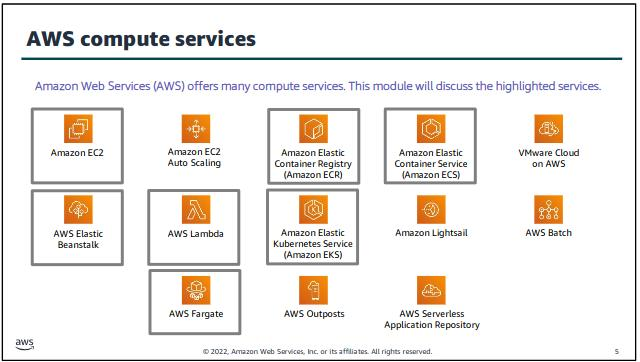
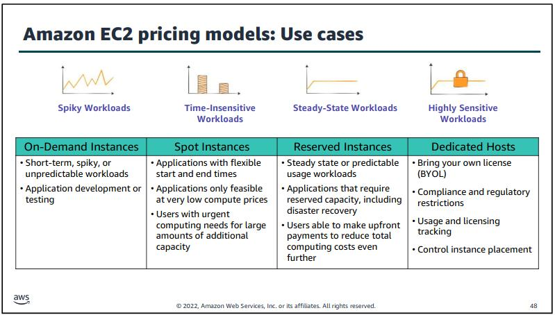

# 2.1.6 Modul 6

## Compute Services Overview

Die folgenden Services werden in diesem Modul genauer angeschaut:

[Bild Quelle - Compute Overview](../../Anhang/quellen.md#compute-overview)

Die nicht markierten Services sind:

- Amazon EC2 Auto Scaling, wird genutzt, um EC2 Instanzen anhand des Workloads automatisch zu vermehren.
- Vmware Cloud on AWS, Vmware Cloud ohne Hardware auf AWS.
- Amazon Lightsail, simple website / application service.
- AWS Batch, ist ein Tool um Batch Job laufen zu lassen.
- AWS Outpost, eine Möglichkeit AWS Dienste On-Premise laufen zu lassen.
- AWS Serverless Application Repository.

Alle Dienste können in vier Kategorien eingeteilt werden.

- IaaS, für Hardware Virtualisierung.
- Serverless Computing, für einfache Dienste - OneTime Scripts.
- Container Based Computing, ähnlich IaaS, einfach ohne das OS aufsetzen zu müssen.
- PaaS, für Web Services.

## Amazon EC2

Zu erwähnen sind die AMIs (Amazon Machine Images), das sind Templates, welche das Aufsetzen von neuen Maschinen erleichtert.
Die verschiedenen Instance Types, sind alle auf verschiedene Workloads optimiert. Die t2 und t3 Instanzen sind für den allgemeinen Gebrauch.
Diese werde ich auch nutzen.

Wenn ein Service wie EC2 mit einem S3 Bucket interagieren soll, und dies nicht über das Internet gehen soll, sondern die internen AWS Möglichkeiten nutzen, so muss der EC2 Instanz eine Rolle zugewiesen werden.

Jede Instanz kann über sich selbst Metadaten nachschauen. Über einen Webbrowser, kann die URL <http://169.254.169.254/latest/meta-data/> abgerufen werden, welche die Metadaten zur Verfügung stellt.

CloudWatch bietet eine integrierte Möglichkeit die VM Metrics nachzusehen.

## Amazon EC2 Cost Optimisation

AWS empfiehlt je nach Load Type unterschiedliche Instanzen zu nutzen.
Diese Cloud-Computing Types eignen sich am besten für diese spezifische Workloads und bringen daher schon den Preis runter.

[Bild Quelle - Load Types](../../Anhang/quellen.md#load-types)

Nebst dieser Optimization, gibt es noch folgende Ratschläge.

- die richtige Grösse wählen, sollte die Instance zu viel Power alloziert haben, kostet dies mehr.
- Elastische Workloads einsetzen, z.B. für Webserver nicht Überdimensionieren, sondern die Elastizitätsprodukte von Amazon nutzen, um die Instances zu skalieren.

## Container Services

AWS bietet verschiedene Container Services, welche es ermöglichen das Betriebssystem zu virtualisieren.

ECS ist das Kubernetes von Amazon. Man kann damit Container orchestrieren. Zusätzlich dazu integriert es sich wieder nahtlos in bestehende Produkte ein.

Die Container werden auf EC2 Instanzen verteilt, welche dem Kunden zugeordnet sind. Die Container sind also separiert von den Containers anderer Kunden.

Sollte das kein essenzielles Feature sein, kann Fargate genutzt werden. Das ist die Container Engine von AWS.

Sollte man direkt Kubernetes nutzen wollen, kann dies auf AWS auch gemacht werden.

Mit ECR (Elastic Container Registry) bietet AWS einen Imagedienst für Container.

## AWS Lambda

Mit Lambda können einfache Code Snippets ausgeführt werden, ohne das ein Server dafür aufgesetzt werden muss.

Die Funktionen können zeitbasiert getriggert werden, oder auf ein bestimmtes Event hin.

Das Erstellen der Funktionen ist gratis, erst das Ausführen kostet.

Man kann Lambda mit Cronjobs vergleichen.

## Elastic Beanstalk

Kann als Erweiterung von Lambda angesehen werden. Man lädt Code hoch und AWS erstellt die Ressourcen darunter automatisch.

Der Service an sich ist gratis, die Ressourcen welche erstellt werden muss mann jedoch bezahlen.

-----

[2.1.7 Erfahrungen Modul 7](./modul7.md)

[Zurück zum Unterverzeichnis](../README.md)
