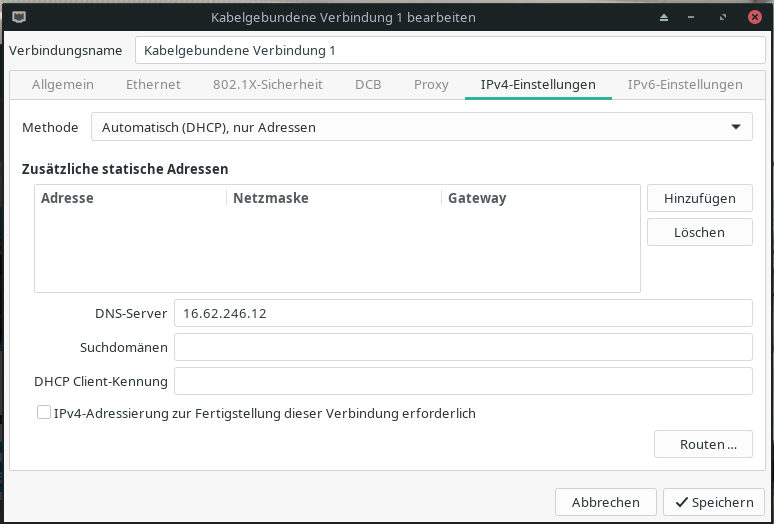
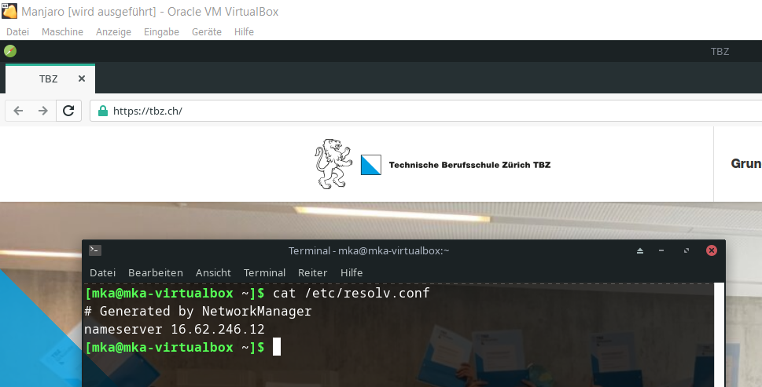

# 2.2.5 DNS Abfragen testen

Ich teste meinen DNS-Server, indem ich ihn an einem neuen System als Haupt-DNS-Server konfiguriere.

Falls das System weiterhin nutzbar ist / surfen kann, betrachte ich den Test als Erfolg.

## Pre Config

Bevor ich meinen DNS-Server als Hauptserver konfigurieren konnte, sah die Config folgendermassen aus:

```
[mka@mka-virtualbox ~]$ cat /etc/resolv.conf 
# Generated by NetworkManager
search tbz.local
nameserver 10.62.99.8
nameserver 10.62.98.8
```

## Post Config

Ich konnte die DNS Config über das NetworkManager GUI ganz einfach anpassen.



Nun sieht /etc/resolv.conf folgendermassen aus.

```
[mka@mka-virtualbox ~]$ cat /etc/resolv.conf 
# Generated by NetworkManager
nameserver 16.62.246.12
```

## CLI Abfrage

Eine ganz einfache `nslookup` Abfrage zeigt, dass der Service funktioniert.

```
[mka@mka-virtualbox ~]$ nslookup tbz.ch
Server:		16.62.246.12
Address:	16.62.246.12#53

Non-authoritative answer:
Name:	tbz.ch
Address: 149.126.4.25

[mka@mka-virtualbox ~]$ 
```

## Test mit Browser

Wie man im unteren Bild erkennen kann, funktioniert eine normale Abfrage tadellos.



-----

Als Nächstes möchte ich die Werbeblocking Funktionalität testen.

[2.2.6 Werbeblocker testen](./werbeblocker_testen.md)

[Zurück zum Unterverzeichnis](../README.md)