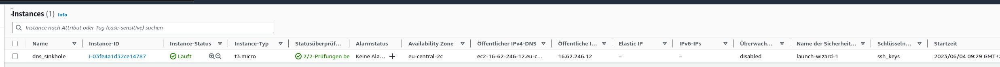

# EC2 Server erstellen

Für meine Semesterarbeit habe ich mir einen Standard EC2 Server aufgesetzt.

Der Servername ist "dns_sinkhole", ansonsten wurde keine Systemänderungen an dieser Maschine gemacht.

Für die Login-Methode nutze ich "ed25519" SSH Keys.

Die SSH Keys wurden von AWS generiert und auf meinen PC kopiert.

Ich habe eine neue Sicherheitsgruppe erstellt, mit limitiertem Zugriff für SSH von meiner festen IP von Zuhause.

Cloud-Init habe ich nicht genutzt, da meine Semesterarbeit sich auf die AWS Zertifizierung fokussiert.

Bei der Netzwerkconfig habe ich das Standard VPC genutzt, mit den Standard Subnets.

```
  172.31.0.0/16 VPC
  172.31.16.0/20 eu-central-2b
  172.31.32.0/20 eu-central-2c
  172.31.0.0/20 eu-central-2a
```

Als Availability Zone habe ich die Availability Zone gewählt:

    eu-central-2c

Die automatische Zuweisung von öffentlichen IPs habe ich deaktiviert, da ich eine Elastic IP einsetzen möchte.

Dies aus dem Grund, dass diese IP zu 100% immer dieselbe bleiben wird, und auf verschiedene Server "geschoben" werden kann.

Die zugeteilte Elastic IP ist 16.62.27.19



Um auf diese Instanz zu kommen, nutze ich auf meiner lokalen Maschine diesen Command.

    ssh -i /home/mka/.ssh/ssh_keys ubuntu@16.62.27.19

Nun kann ich damit beginnen, den [PiHole zu installieren.](./pihole_installieren.md)

-----

[Zurück zum Unterverzeichnis](../README.md)