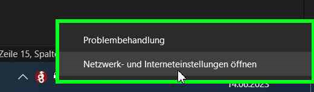
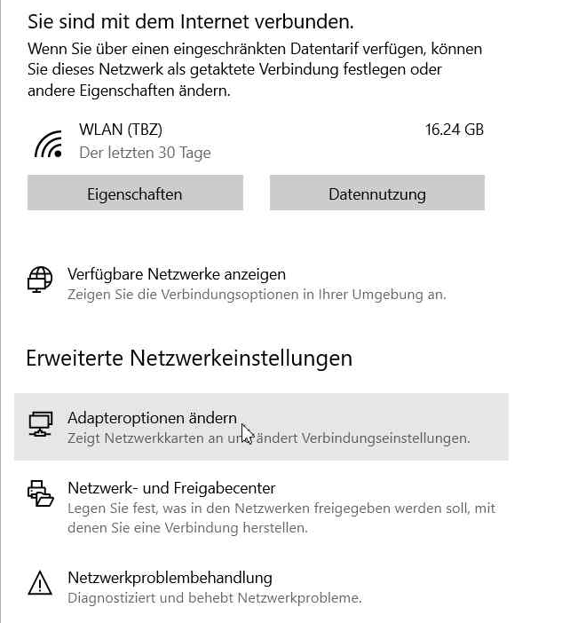
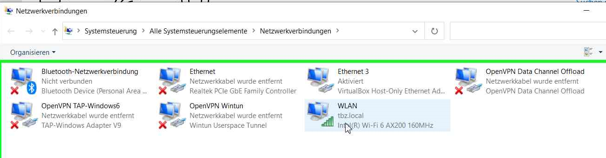
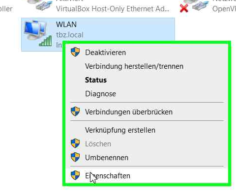
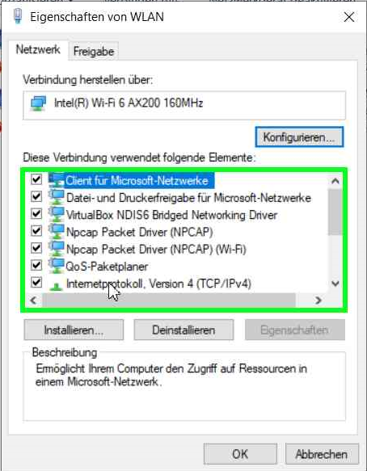
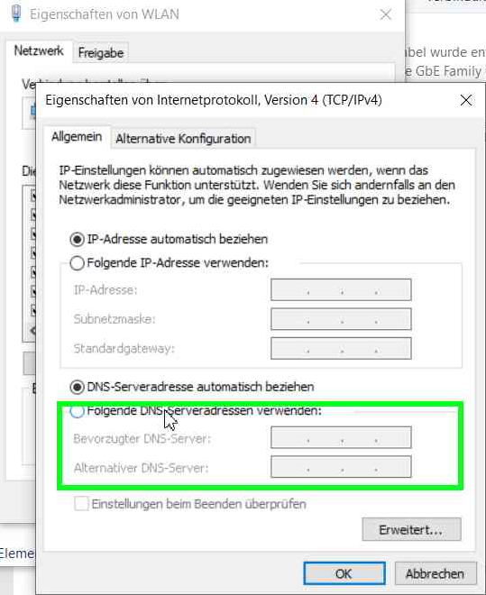
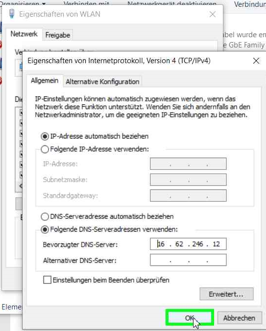

# 2.2.7 Handbuch schreiben

Damit dieses Tool genutzt werden kann, muss ich ein kleines Handbuch schreiben.

Ich integriere dieses Handbuch einfachshalber direkt in dieses Markdown.

## Wie nutze ich diesen Dienst?

Dieser Dienst benötigt keine zusätzlich installierte Software oder ein umfassendes Informatikwissen.

Damit dieser Dienst genutzt werden kann, muss nur eine Systemeinstellung vorgenommen werden.

Dies macht man folgendermassen:

Rechtsklick auf das Internetzeichen in der Taskbar.

Anschliessend auf "Netzwerk- und Interneteinstellungen öffnen" klicken:

Dann werden sich die Einstellungen öffnen und anschliessend muss man die Adapteroptionen ändern:

In diesen Adapteroptionen kann man anschliessend unser aktives Netzwerk auswählen und dessen Eigenschaften öffnen:

Daraufhin öffnen sich die Optionen dieses Interfaces. In diesen Optionen wählt man IPv4 aus:

Das IPv4 Menüöffnet sich, was es uns erlaubt einen eigenen DNS Server zu definieren. Diese Optionen füllen wir mit unserem DNS Server (16.62.246.12):

Anschliessend können alle Menüs mit "OK" bestätigt werden und die Fenster geschlossen werden. Der DNS Service ist nun eingerichtet und kann genutzt werden.

-----

[2.2.8 Nebenprojektabschluss](./projektabschluss.md)

[Zurück zum Unterverzeichnis](../README.md)
