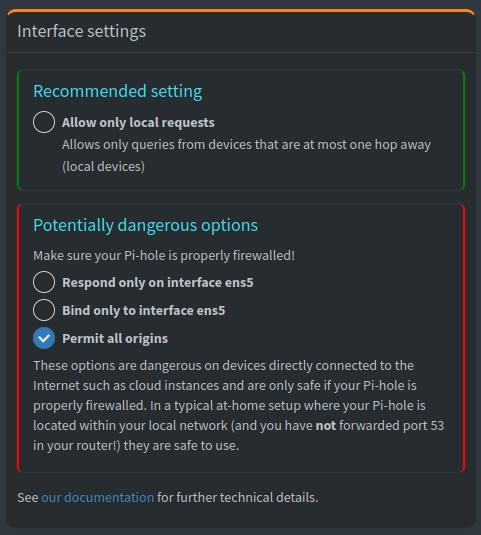

# PiHole installieren

Ich bin dieser Anleitung gefolgt und konnte die PiHole Software so installieren.

[Original Anleitung - Quelle](../../Anhang/quellen.md#pi-hole-manual)

Mit diesen Commands und Reboots wurde die Software installiert.

Es wurden überall die Standardoptionen genutzt, daher verzichte ich auf Screenshots für jede Option.

```
    sudo apt update
    sudo apt upgrade -y
    sudo reboot
    sudo hostnamectl set-hostname AWS_PiHole
    sudo curl -sSL https://install.pi-hole.net | bash
    sudo reboot
```

Sollte eine Option trotzdem falsch gewählt worden sein, so kann ich diese mit diesem Command rekonfigurieren.

    pihole -r

Mit dieser URL kann ich nun auf das Webinterface von PiHole zugreifen.

<http://ec2-16-62-27-19.eu-central-2.compute.amazonaws.com/admin/login.php>

!! Ganz wichtig HTTP nicht HTTPS !!

Als PW wird der Output genutzt, von der Installation.


Der DNS-Server ist nun Up and Running laut Webinterface. Von meinem PC komme ich aber noch nicht drauf.

```
[mka@home ~]$ nslookup meuthak.ch 16.62.27.19
;; communications error to 16.62.27.19#53: timed out
;; communications error to 16.62.27.19#53: timed out
;; communications error to 16.62.27.19#53: timed out
;; no servers could be reached
```

Der Request kommt jedoch auf dem Server an. 

Die Network ACL erlaubt ausgehend alles und die Security Group ist Stateful.

Dies verleitet mich dazu, das Routing infrage zu stellen.

```
ubuntu@AWSPiHole:~$ sudo tcpdump -i any port 53
tcpdump: data link type LINUX_SLL2
tcpdump: verbose output suppressed, use -v[v]... for full protocol decode
listening on any, link-type LINUX_SLL2 (Linux cooked v2), snapshot length 262144 bytes
08:33:49.218220 ens5  In  IP 45.94.88.37.39230 > ip-172-31-46-107.eu-central-2.compute.internal.domain: 16186+ A? meuthak.ch. (28)
08:33:49.252181 ens5  Out IP ip-172-31-46-107.eu-central-2.compute.internal.34698 > ip-172-31-0-2.eu-central-2.compute.internal.domain: 29275+ PTR? 107.46.31.172.in-addr.arpa. (44)
08:33:49.252357 ens5  In  IP ip-172-31-0-2.eu-central-2.compute.internal.domain > ip-172-31-46-107.eu-central-2.compute.internal.34698: 29275 1/0/0 PTR ip-172-31-46-107.eu-central-2.compute.internal. (104)
08:33:49.252430 ens5  Out IP ip-172-31-46-107.eu-central-2.compute.internal.53113 > ip-172-31-0-2.eu-central-2.compute.internal.domain: 63321+ PTR? 37.88.94.45.in-addr.arpa. (42)
08:33:49.252520 ens5  In  IP ip-172-31-0-2.eu-central-2.compute.internal.domain > ip-172-31-46-107.eu-central-2.compute.internal.53113: 63321 NXDomain 0/1/0 (133)
08:33:49.356083 ens5  Out IP ip-172-31-46-107.eu-central-2.compute.internal.32828 > ip-172-31-0-2.eu-central-2.compute.internal.domain: 27602+ PTR? 2.0.31.172.in-addr.arpa. (41)
08:33:49.356203 ens5  In  IP ip-172-31-0-2.eu-central-2.compute.internal.domain > ip-172-31-46-107.eu-central-2.compute.internal.32828: 27602 1/0/0 PTR ip-172-31-0-2.eu-central-2.compute.internal. (98)
08:34:21.873079 ens5  In  IP 45.94.88.37.48037 > ip-172-31-46-107.eu-central-2.compute.internal.domain: 38892+ A? meuthak.ch. (28)
08:34:26.883125 ens5  In  IP 45.94.88.37.40003 > ip-172-31-46-107.eu-central-2.compute.internal.domain: 38892+ A? meuthak.ch. (28)
08:34:31.883347 ens5  In  IP 45.94.88.37.47759 > ip-172-31-46-107.eu-central-2.compute.internal.domain: 38892+ A? meuthak.ch. (28)
```

Als erste Massnahme habe die Elastic IP entfernt und mit öffentlichen IPs vom Subnetz rekonfiguriert.

Dies aus Verdacht, das die Elastic IP evtl. nicht für solche Fälle gedacht ist.

Jedoch besteht das Problem weiterhin, auch nach der Änderung. Als Test habe ich nun Security Group für Pings geöffnet.

```
[mka@home ~]$ ping 16.62.246.12
PING 16.62.246.12 (16.62.246.12) 56(84) bytes of data.
64 bytes from 16.62.246.12: icmp_seq=1 ttl=54 time=10.5 ms
64 bytes from 16.62.246.12: icmp_seq=2 ttl=54 time=11.2 ms
64 bytes from 16.62.246.12: icmp_seq=3 ttl=54 time=9.76 ms
64 bytes from 16.62.246.12: icmp_seq=4 ttl=54 time=11.3 ms
64 bytes from 16.62.246.12: icmp_seq=5 ttl=54 time=17.9 ms
64 bytes from 16.62.246.12: icmp_seq=6 ttl=54 time=9.37 ms
^C
--- 16.62.246.12 ping statistics ---
6 packets transmitted, 6 received, 0% packet loss, time 5008ms
rtt min/avg/max/mdev = 9.371/11.687/17.940/2.884 ms
```

Die Pings kommen durch, das Routing ist also korrekt.

Nach weiterem Suchen habe ich schliesslich diese Option hier gefunden.



Nach dieser Umstellung funktionierte der Service.

```
[mka@home ~]$ nslookup meuthak.ch 16.62.246.12
Server:		16.62.246.12
Address:	16.62.246.12#53

Non-authoritative answer:
Name:	meuthak.ch
Address: 212.117.214.100
```

Ich verzichte im weiteren Verlauf auf eine Elastic IP, da ich den Server wohl nicht mehr neu aufsetzen werde.

Mit diesem Request habe ich also bewiesen, dass DNS Abfragen möglich sind und werde nun zum Testing übergehen.

-----

[Zurück zum Unterverzeichnis](../README.md)
