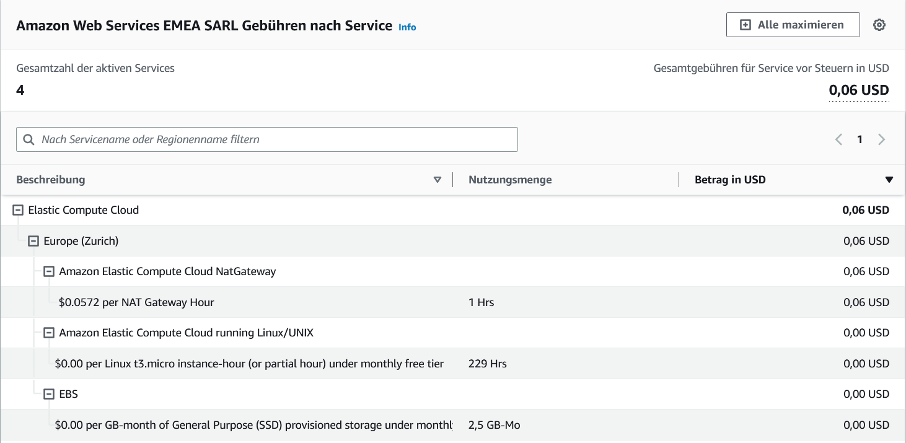

# 2.2.8 Projektabschluss

Ich konnte in diesem kleinen Nebenprojekt einige Ziele meines Hauptprojekts erreichen.

Meine Ziele habe ich [hier definiert.](../../Einleitung/ziele.md) Die Folgenden konnte ich erreichen:

* Nutzbaren DNS-Server einrichten.
* Messbar tiefere Werbebelastung bei Nutzung des Sinkhole Servers.
* Massnahmen treffen, um die Kostenbelastung meinerseits so weit wie möglich zu reduzieren.
* Billing Alarm einrichten.

Diese zwei Ziele konnte ich nicht realisieren. Dies lag unter anderem daran, dass ich den Revolut Service nicht aufgesetzt habe und das ich die Free Tier Limiten überschritten habe. Ich habe den NAT Gateway Service genutzt, welcher nicht im FreeTier inbegriffen ist.

* Künstliche Kreditkarte hinterlegen. (Revolut Service)
* Free Tier Service nutzen soweit möglich.

Ich muss nun als Resultat von diesem Fehlschlag folgende Kosten hinnehmen.

-----

[3. Schlussteil](../../Schlussteil/README.md)

[Zurück zum Unterverzeichnis](../README.md)
