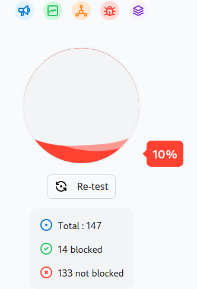

# Werbeblocker testen

Nun da ich weis, dass der DNS Server funktioniert, möchte ich testen ob dies auch einen merkbaren Unterschied beim Surfen bringt.

## Testverfahren

Ich nutze für diesen Test folgende Seite:

<https://d3ward.github.io/toolz/adblock.html>

Diese Webseite bietet einen messbaren Wert, mit welchem ich vergleichen kann wie viel mein DNS Server bringt.

## Testergebnisse - Standard

Mit dem Standrad TBZ Server, erziele ich folgende Resultate:

```
[mka@mka-virtualbox ~]$ cat /etc/resolv.conf
# Generated by NetworkManager
search tbz.local
nameserver 10.62.99.8
nameserver 10.62.98.8
[mka@mka-virtualbox ~]$ 
```



Mit keinem Blocker werden 10% der Ads geblockt. Ich vermute diese 10% sind russischen URLs / IPs zuzuordnen, welche aufgrund der letzten Ereignisse blockiert werden.


Ich erwarte mit meinem DNS Server nun also mindestens 11% oder mehr, damit wir einen merkbaren Benefit sehen können.

## Testergebnisse - PiHole

Wie erwartet schneidet der Test mit meinem PiHole besser ab. Ich erreiche beinahe 60%.

```
[mka@mka-virtualbox ~]$ cat /etc/resolv.conf
# Generated by NetworkManager
nameserver 16.62.246.12
[mka@mka-virtualbox ~]$ 
```


Momentan läuft der DNS Server mit der Standard Konfiguration, somit ist die Blockliste nicht sehr ausgereift.

Ich könnte die Blockliste weiter ergänzen und so einen höheren Wert erreichen. Für meine Zwecke reicht dieses Resultat jedoch vollkommen.

Die Standard Blockliste kann man hier finden:

<https://raw.githubusercontent.com/StevenBlack/hosts/master/hosts>

-----

Mit diesen Ergebnissen setze ich mich nun daran ein Handbuch zu schreiben, damit dieser Service auch genutzt werden kann.

[Handbuch schreiben](./handbuch.md)

-----

[Zurück zum Unterverzeichnis](../README.md)