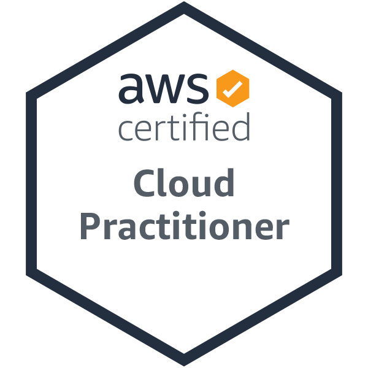

# Semesterarbeit Semester 1 - ITCNE23 - Marco Kälin

Dieses Repo dient als Dokumentationsstandort für meine Semesterarbeit.
Meine Arbeit beinhaltet die AWS Zertifizierung mit einem kleinen Nebenprojekt.

Ich möchte meinen Werdegang zur AWS Zertifizierung dokumentieren und nützliche Tipps in diese Dokumentation integrieren.

[Bild Quelle - AWS Titelblatt](./Anhang/quellen.md#aws-titelblatt)

## Dokumentationsaufbau

Für meine Dokumentation nutze ich GitHub.

## Inhaltsverzeichnis

[1. Einleitung](./Einleitung/README.md)

[1.1 Was mache ich überhaupt?](./Einleitung/projektidee.md)

[1.2. Was ist AWS?](./Einleitung/was_ist_aws.md)

[1.3 Zeitplan](./Einleitung/zeitplan.md)

[1.4 Projektmethode](./Einleitung/projektmethode.md)

[1.5 Was möchte ich erreichen?](./Einleitung/ziele.md)

[1.6 Was sind meine Risiken?](./Einleitung/risiken.md)

-----

[2. Hauptteil](./Hauptteil/README.md)

[2.1 Was mache ich als Nebenprojekt](./Hauptteil/Nebenprojekt/nebenprojekt.md)

[2.2 AWS Module - Zusammenfassung](./Hauptteil/AWS_Academy_Module/modul_zusammenfassung.md)

[2.2.1 AWS Academy Modul 1](./Hauptteil/AWS_Academy_Module/modul1.md)

[2.2.2 AWS Academy Modul 2](./Hauptteil/AWS_Academy_Module/modul2.md)

[2.2.3 AWS Academy Modul 3](./Hauptteil/AWS_Academy_Module/modul3.md)

[2.2.4 AWS Academy Modul 4](./Hauptteil/AWS_Academy_Module/modul4.md)

[2.2.5 AWS Academy Modul 5](./Hauptteil/AWS_Academy_Module/modul5.md)

[2.2.6 AWS Academy Modul 6](./Hauptteil/AWS_Academy_Module/modul6.md)

[2.2.7 AWS Academy Modul 7](./Hauptteil/AWS_Academy_Module/modul7.md)

[2.2.8 AWS Academy Modul 8](./Hauptteil/AWS_Academy_Module/modul8.md)

[2.2.9 AWS Academy Modul 9](./Hauptteil/AWS_Academy_Module/modul9.md)

[2.2.10 AWS Academy Modul 10](./Hauptteil/AWS_Academy_Module/modul10.md)

-----

[3. Abschluss](./Schlussteil/README.md)

[3.1 Habe ich meine Ziele erreicht?](./Schlussteil/erreichte_ziele.md)

[3.2 Was waren meine Probleme?](./Schlussteil/probleme.md)

[3.3 Schlusswort](./Schlussteil/schlusswort.md)

-----

[4. Anhang](./Anhang/README.md)

[4.1 Quellen](./Anhang/quellen.md)

[4.2 Glossar](./Anhang/glossar.md)
